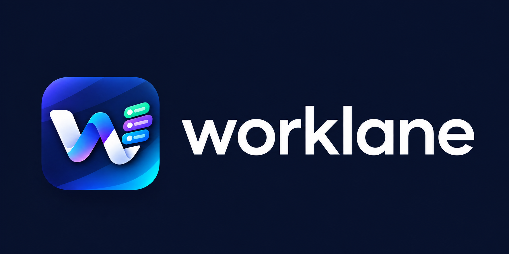
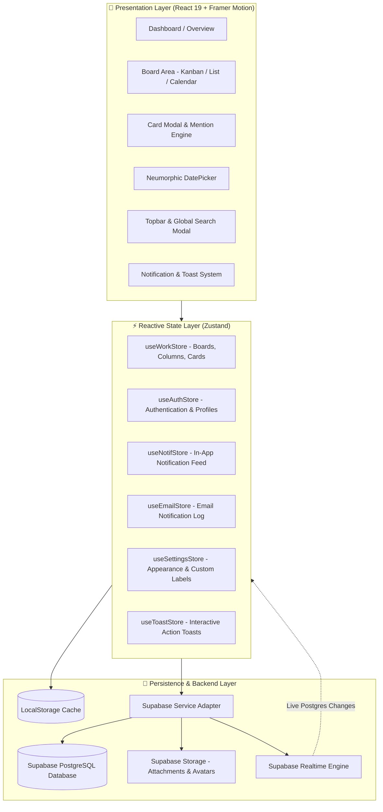
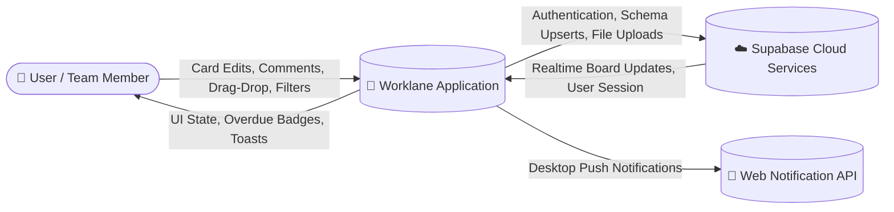
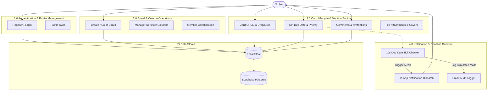

<div align="center">

  

  <br />

  <h1>🚀 Worklane</h1>
  <p><strong>A Next-Generation Neumorphic Project Management & Collaborative Kanban Workspace</strong></p>

  <p>
    <a href="https://react.dev/"></a>
    <a href="https://www.typescriptlang.org/"></a>
    <a href="https://vitejs.dev/"></a>
    <a href="https://supabase.com/"></a>
    <a href="https://zustand.docs.pmnd.rs/"></a>
    <a href="https://www.framer.com/motion/"></a>
  </p>

</div>

---

## 📖 Table of Contents
1. [Overview](#-overview)
2. [Key Features](#-key-features)
3. [Design System & Aesthetics](#-design-system--aesthetics)
4. [System Architecture](#-system-architecture)
5. [Data Flow Diagrams (DFD)](#-data-flow-diagrams-dfd)
   - [Level 0: Context Diagram](#level-0-context-diagram)
   - [Level 1: System Decomposition](#level-1-system-process-decomposition)
6. [User Stories & Acceptance Criteria](#-user-stories)
7. [Tech Stack](#-tech-stack)
8. [Database Schema (Supabase)](#-database-schema-supabase)
9. [Getting Started](#-getting-started)
10. [License](#-license)

---

## 🌟 Overview

**Worklane** is a high-performance, tactile project management web application built with React 19, TypeScript, and a bespoke Neumorphic design system. Designed for agile teams and creators, Worklane combines smooth physical interactions, multi-view boards (Kanban, List, Calendar), contextual navigation, real-time due-date automation, and team mention engines into a cohesive workspace.

Worklane runs with zero-latency client state persisted locally and is architected for instant plug-and-play cloud synchronization with **Supabase PostgreSQL & Storage**.

---

## ✨ Key Features

### 🗂️ 1. Multi-Board & Workspace Management
- Create, color-code, and manage multiple team workspaces.
- Real-time Board Overview dashboard aggregating active tasks, recent boards, team activity logs, and deadline statistics across all boards.
- Context-aware topbars dynamically adapting breadcrumbs, search scopes, and member controls between Overview and Board modes.

### 📋 2. Multi-View Kanban & Productivity Modes
- **Kanban Board View**: Fluid drag-and-drop cards across custom workflow columns (e.g. *To Do*, *In Progress*, *Review*, *Done*) with auto-completion rules.
- **Compact List View**: High-density task table with priority indicators, column filters, and quick toggles.
- **Interactive Calendar View**: Month-grid schedule displaying deadlines, due statuses, and single-click task modal inspection.

### ⏰ 3. Real-Time Due Date & Overdue Notification Engine
- **Neumorphic Date & Time Picker**: Tactile 12-hour clock and calendar selector with instant auto-save and quick presets (`Today`, `Tomorrow`, `End of Week`, `Next Week`).
- **Live Overdue Transition**: Real-time tick engine that automatically transitions badges from amber (`Due Soon`) to prominent highlighted red (`Overdue`) the second a deadline expires.
- **Targeted Notifications**: Automated in-app alerts and email notifications dispatched exclusively to assigned card members upon deadline arrival or task assignments.

### 👥 4. Team Collaboration & Mention System
- **@Mention Engine**: Autocomplete member tagging in card comment streams with instant direct notifications.
- **Member Permission Guard**: Secure avatar upload controls restricting profile photo changes to the authenticated account.
- **Cross-Board Assignee Matching**: Dynamic filter allowing users to view all cards assigned to them across all workspace boards.

### 🔍 5. Global Command Palette & Quick Search
- Press <kbd>Ctrl</kbd> + <kbd>K</kbd> / <kbd>Cmd</kbd> + <kbd>K</kbd> anywhere to trigger fuzzy global search across boards, task titles, descriptions, assignees, and label tags.

---

## 🎨 Design System & Aesthetics

Worklane is engineered with a **Soft Neumorphic** design philosophy:
- **Light & Dark Theme**: Custom tailored HSL tokens with smooth theme transitions.
- **Dual-Layer Shadows**: Precise combination of concave insets and extruded elevations (`var(--neu-shadow-raised-sm)`, `var(--neu-shadow-inset)`).
- **Micro-Interactions**: Framer Motion physics for tactile button presses, 3D card tilt physics, modal spring transitions, and floating notifications.
- **Custom Interactive Action Toasts**: Replaces generic browser popups with glassmorphic, interactive confirmation banners.

---

## 🏗️ System Architecture

Worklane utilizes a modular layered architecture with unidirectional reactive state management and a hybrid storage adapter.



---

## 🔄 Data Flow Diagrams (DFD)

### Level 0: Context Diagram



---

### Level 1: System Process Decomposition



---

## 📝 User Stories

### Persona 1: Project Manager / Team Lead
| ID | User Story | Acceptance Criteria |
| :--- | :--- | :--- |
| **US-01** | **As a** Project Manager, **I want to** create distinct boards with custom color themes, **so that** I can organize different company initiatives. | • Board modal allows custom name and color palette selection.<br>• New boards immediately appear in sidebar and overview. |
| **US-02** | **As a** Team Lead, **I want to** set exact due dates and times on tasks, **so that** my team delivers milestones on schedule. | • Neumorphic date & time picker auto-saves date & time.<br>• Tasks display due date tags with real-time status transitions. |
| **US-03** | **As a** Project Manager, **I want** overdue tasks to alert assignees automatically, **so that** delays are addressed immediately. | • Automated background checker evaluates deadlines every 10s.<br>• Dispatches notifications and alert styling to assigned members. |

### Persona 2: Developer / Contributor
| ID | User Story | Acceptance Criteria |
| :--- | :--- | :--- |
| **US-04** | **As a** Developer, **I want to** filter tasks by "Assigned to Me" across all boards, **so that** I have a single consolidated daily to-do list. | • Dashboard filter checks card assignees matching current user email.<br>• Displays card along with board badge and column origin. |
| **US-05** | **As a** Contributor, **I want to** mention teammates with `@username` in comments, **so that** I can ask for reviews or feedback directly. | • Typing `@` opens interactive member autocomplete dropdown.<br>• Mentioned teammate receives a high-priority in-app notification. |
| **US-06** | **As a** Team Member, **I want to** drag and drop cards to "Done", **so that** the task is automatically marked as completed. | • Dropping into "Done" sets `completed: true` with completion timestamp.<br>• Moving out of "Done" reopens the task. |

### Persona 3: Workspace Collaborator
| ID | User Story | Acceptance Criteria |
| :--- | :--- | :--- |
| **US-07** | **As a** Collaborator, **I want to** switch between Kanban, List, and Calendar views, **so that** I can visualize project deadlines in my preferred layout. | • View switcher toggles between Kanban board, List table, and Calendar.<br>• Calendar view plots cards on their respective deadline cells. |
| **US-08** | **As a** User, **I want to** quickly search tasks across the entire app with <kbd>Ctrl</kbd>+<kbd>K</kbd>, **so that** I can jump to any card instantly. | • Keyboard shortcut opens fuzzy search modal.<br>• Clicking a search result opens the card modal directly. |

---

## 💻 Tech Stack

| Technology | Purpose |
| :--- | :--- |
| **React 19** | Modern UI components with fast concurrent rendering |
| **TypeScript 5.8** | End-to-end type safety and domain models |
| **Vite 6** | Instant HMR development server and optimized bundle build |
| **Zustand 5** | Unidirectional state management with middleware persistence |
| **Supabase** | Cloud PostgreSQL database, Row Level Security, Storage, & Realtime |
| **Framer Motion** | Physical micro-animations, 3D tilt, and layout transitions |
| **Lucide Icons** | Clean, consistent vector iconography |
| **Vanilla CSS / Modern Tokens** | Pure custom Neumorphic design system with HSL variables |

---

## 🗄️ Database Schema (Supabase)

Worklane includes a complete SQL schema ready to execute in your Supabase SQL Editor:
- **`supabase_schema.sql`**: Contains complete DDL for `profiles`, `boards`, `board_members`, `columns`, `cards`, `card_assignees`, `card_labels`, `custom_labels`, `attachments`, `comments`, `notifications`, `email_logs`, storage buckets, and RLS policies.

---

## 🚀 Getting Started

### 1. Clone & Install Dependencies
```bash
git clone https://github.com/nyxieeee/Worklane.git
cd Worklane
npm install
```

### 2. Configure Supabase (Optional for Cloud Sync)
Create a `.env` file from `.env.example`:
```bash
cp .env.example .env
```
Add your Supabase credentials:
```env
VITE_SUPABASE_URL=https://your-project-id.supabase.co
VITE_SUPABASE_ANON_KEY=your-anon-public-key-here
```

### 3. Run Database Migrations
Copy the contents of [`supabase_schema.sql`](supabase_schema.sql) and execute it in your **Supabase Dashboard $\rightarrow$ SQL Editor**.

### 4. Start Local Development
```bash
npm run dev
```
Open [http://localhost:5173](http://localhost:5173) in your browser.

### 5. Build for Production
```bash
npm run build
```

---

## 📄 License

Distributed under the **MIT License**. See `LICENSE` for more information.

<div align="center">
  <sub>Built with ❤️ by Uno for productive teams worldwide.</sub>
</div>
